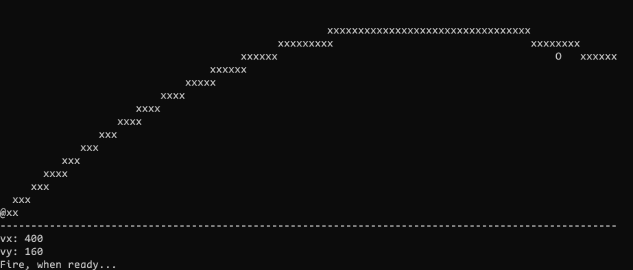

# Starshooter

Terminal game in c++ where you need to hit a target with x/y coordinates

Example of Game:
[./starshooter_example.png]

## ToDo

- Implement shooting angle and velocity instead of vx/vy
- count the number of tries

